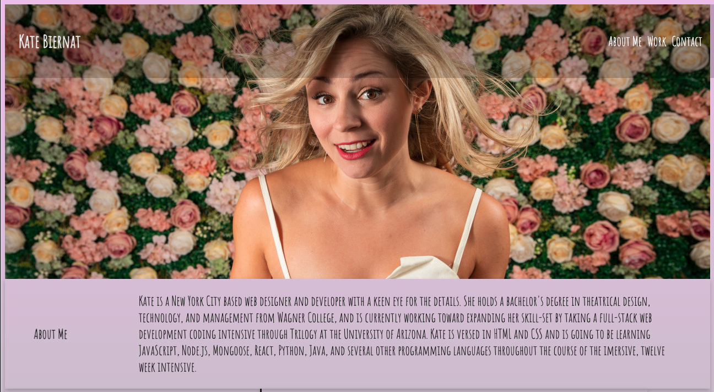
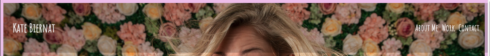
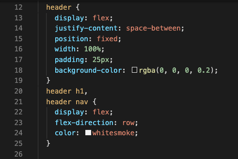
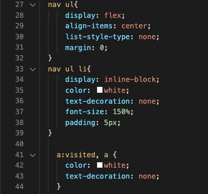
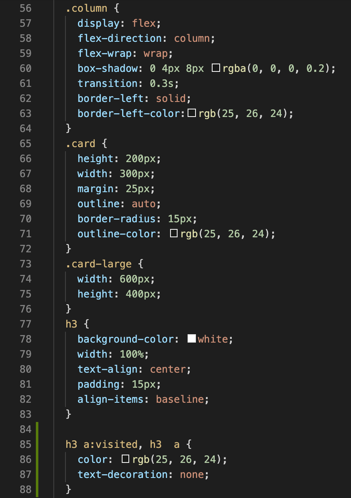
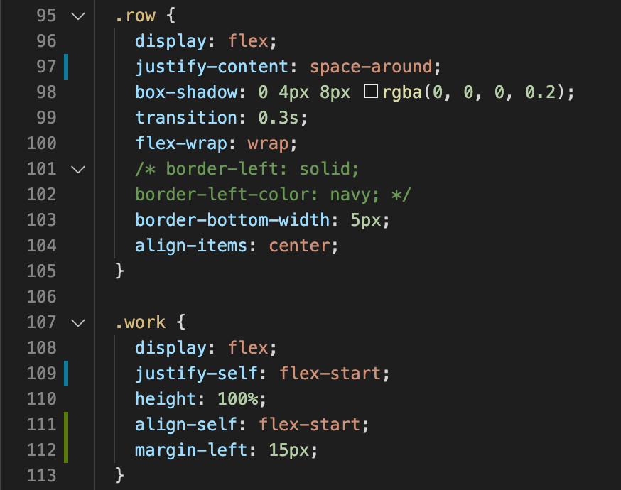
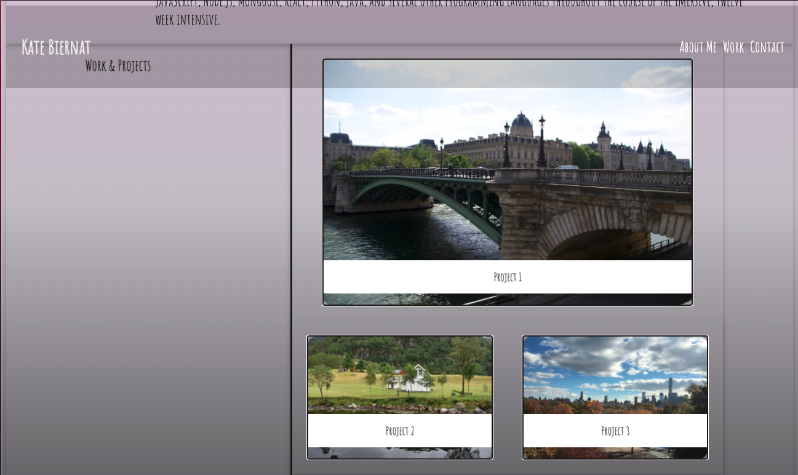
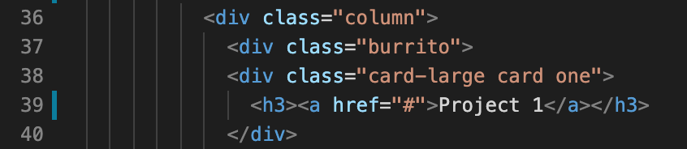
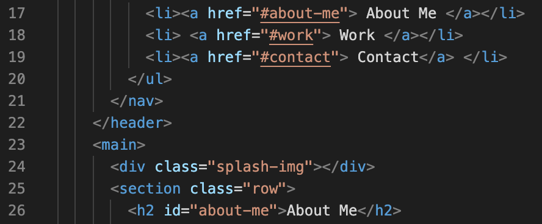
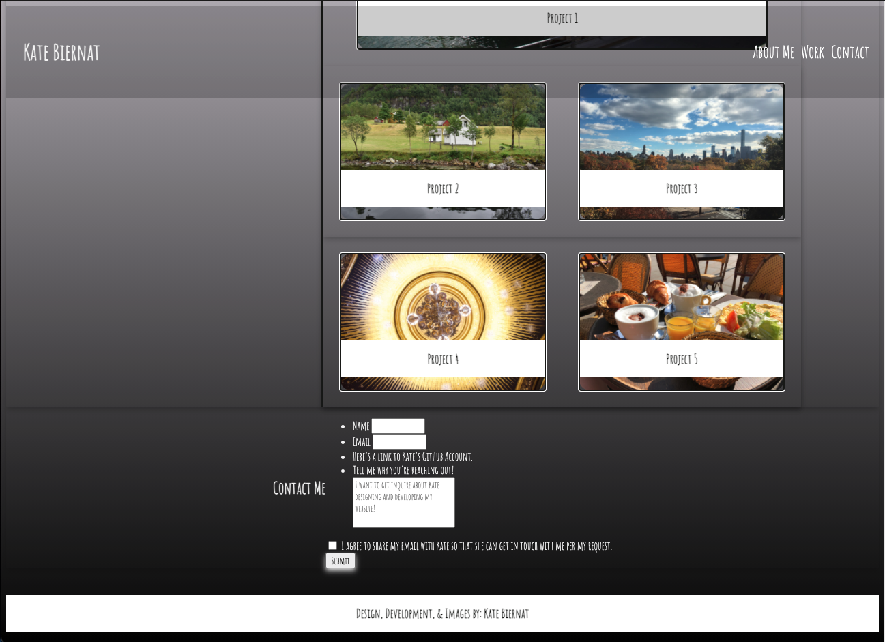

# Kate-Biernat-Portfolio
Kate Biernat's Portfolio of Work from February 2021 - May 2021

## Portfolio URL
Kate's Portfolio Website can be found at https://kebiernat5.github.io/Kate-Biernat-Portfolio/

## User Story

As a prospective job candidate, I would like to have a corner of the internet where I can show off my skills as a web developer. As such, a portfolio website where I can put new concepts into practice in real time is a great way to reinforce the new concepts and highlight my mastery of said skills. The result should be a highly polished, beautifully structured portfolio website with my brand statement, links to previous projects, and a way to get in touch with me to potentially work with me. 

## Elements

### Top of the Page

Wide View Header Display

When creating my portfolio application I wanted to create a Header featuring my name and a nav bar that links to elements further down in the main section on my page along with a recent photograph of myself that made me appear to be friendly and approachable. I was able to accomplish this using HTML <  h1 > < link >, < nav >, and < list > tags. The photograph was inserted using a backsplash image style in my CSS sheet. To make all of these elements appear to be on the same line in the heading bar, I styled them into flex boxes and tinkered around with margins and padding until I got it all looking just right. I then styled the links in the style sheet to not noticably transform when clicked to maintain the visual integrity of the page. I also set up a slightly transparent sticky header by using a fixed position in the style sheet so that no matter where you scrolled, you would always be able to click on a different link to get to a different section of the page. The "About Me" section was created using classes and flex boxes.

Header Display Preview

Code View

### Projects and Work | Links and Cards

This section of the page was the most challenging to format. I created one all encompassing flex box, and then nested smaller flex boxes inside of the main one. and formatted the cards and classes accordingly. I wanted to create a box like structure at the bottom of each card which are styled with classes to describe which project the user would be going to and so I created a class to accomplish that as well. Each of the cards are styled to move into a column when the window size shrinks. Then each of the cards has its own class as well to style the photograph in the card.

Code View  

#### Links

I also linked placeholders into the HTML for the card links so that when I hover the mouse over the links they it still creates the selecor tool on the tip  of the mouse. The first card is larger than the other four because it's the primary project and will be updated with the most recent project as I progress through the course.  There are also links to the different sections of the application in the navigation bar in the header. Each tab takes the user to the corresponding section of the page. All links were styled so that even when they are clicked, they show no structural changes in order to maintain the visual integrity of the page.

Page Display

Card Code

Link Code

## Contact Me Card

I created a contact form in my HTML file which includes ways to get in touch with me and a link to my GitHub account which will lead to further materials that might not have made it to my portfolio page. I also was able to add a fun action label/pseudo class for a bit of text to pop up when a check box is actively engaged. I also specified how big the final text box was and its placement in the list of ways to get in touch or view my materials.

Contact Card and Footer View

### Extraneous notes
At the bottom of the CSS file is a code graveyard of code that was useful at some point and changed or deemed extraneous. 

